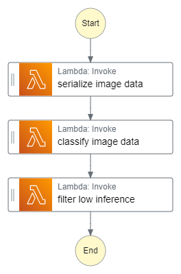
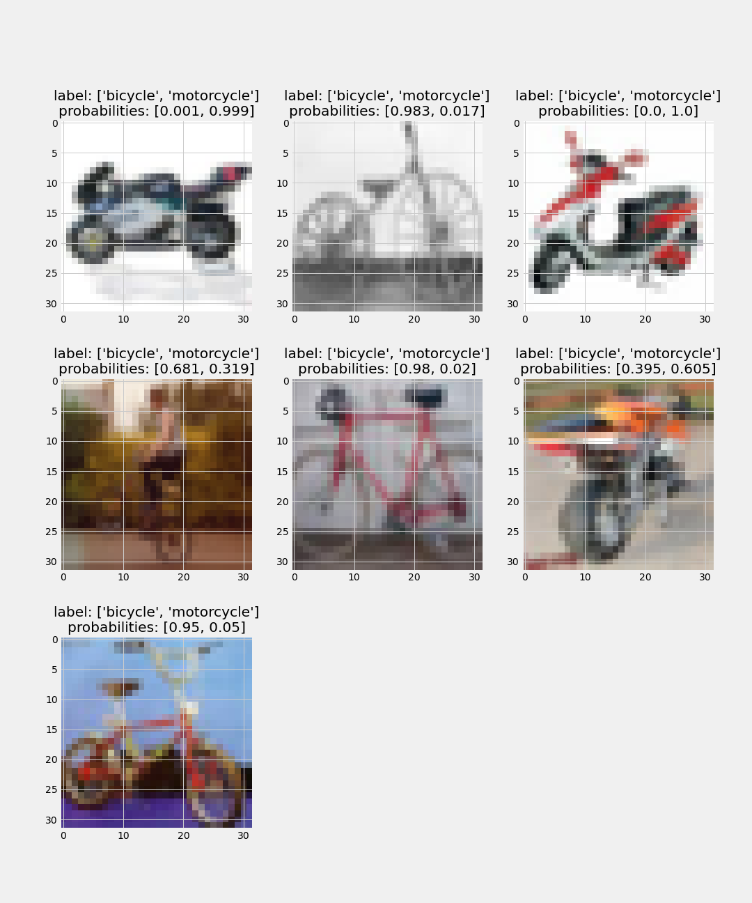

# Overview
The goal of this project is to build an image classification model that can automatically detect which kind of vehicle delivery drivers have, in order to route them to the correct loading bay and orders. Assigning delivery professionals who have a bicycle to nearby orders and giving motorcyclists orders that are farther can help Scones Unlimited optimize their operations.

In this project, AWS Sagemaker is used to build an image classification model that can tell bicycles apart from motorcycles. AWS Lambda function is used to build support services, and AWS Step Function is used to compose model and services into an event-driven application.

# Project Steps
- Step 1: Data staging
- Step 2: Model training and deployment
- Step 3: Lambdas and step function workflow
- Step 4: Testing and evaluation

# Workflow

# Test Result
